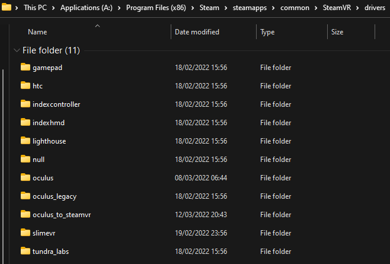

# OculusToSteamVR
Use Oculus controllers with SteamVR headsets.  
**NOTE:** While this can be used it is not complete, more details can be seen at the [todo section](#todo).

  

## Installation:
There are two ways to install the plugin:

- Find your SteamVR driver directory, which should be at:
  `C:\Program Files (x86)\Steam\steamapps\common\SteamVR\drivers`
  and copy the contents of the [latest release](https://github.com/ReadieFur/OculusToSteamVR/releases/latest) into the SteamVR drivers directory. Your folder structure should look something like this:
  

Or  
- Navigate to `C:\Users\%Username%\AppData\Local\openvr` and find the `openvrpaths.vrpath` file. Open this file with your text editor of choice, and under `"external_drivers"`, add another entry with the location of the `oculus_to_steamvr` folder. For example mine looks like this after adding the entry:

```json
{
	"external_drivers": 
	[
		"C:\\Users\\kofre\\Documents\\OculusToSteamVR"
	]
}
```

## Configuration:
By default the Oculus hardware wont be aligned properly in SteamVR space. I don't have a way to automatically calibrate this as of yet, so you will have to calibrate it manually.  
To do this, open SteamVR and with your Oculus controllers press both the `Menu` (on the left controller) and `A` buttons on the controllers.  
This will put the controllers into calibration mode, use the following buttons to move and calibrate the controllers:  
- `X`: Move the controllers up.
- `Y`: Move the controllers down.
- `A`: Move the controllers left.
- `B`: Move the controllers right.
- `Right grip`: Move the controllers forward.
- `Left grip`: Move the controllers backward.  
Once you are happy with your calibration, press both the `Menu` and `A` buttons on the controllers again to exit calibration mode and save the calibration.  
**NOTE:** As of now there is no rotation calibration.

## Devlopers:
### Building:
- Clone the project and submodules
	- `git clone --recursive https://github.com/ReadieFur/OculusToSteamVR.git`
- Build project with CMake
	- `cd OculusToSteamVR && cmake .`
- Open project with Visual Studio and hit build
	- Driver folder structure and files will be copied to the output folder as `oculus_to_steamvr`.

## Credits:
This section is to credit other people who have either directly contributed to the project, or resources I have used that are open source.
| Resource | Author |
| --- | --- |
| [SteamVR driver template](https://github.com/terminal29/Simple-OpenVR-Driver-Tutorial) | [terminal29](https://github.com/terminal29/) |
| [DirectX11 header for Oculus](https://developer.oculus.com/documentation/native/pc/dg-vr-focus/) | [Oculus](https://developer.oculus.com/documentation/native/pc/) |
